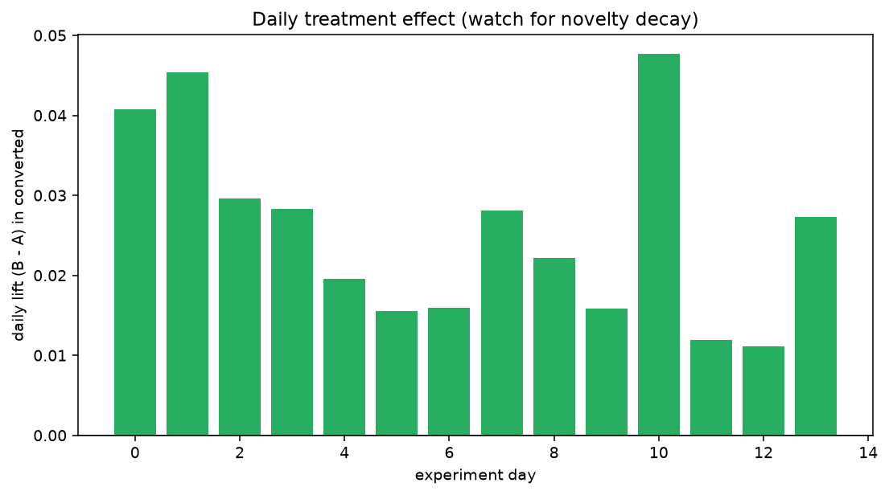
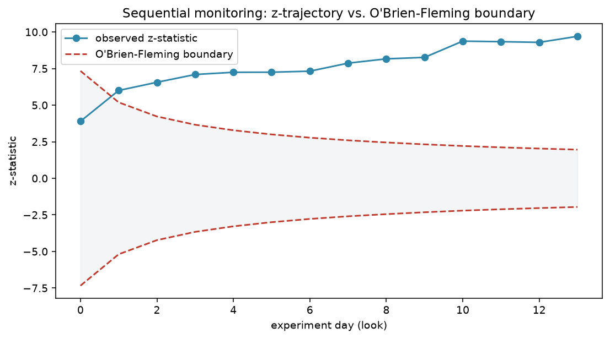
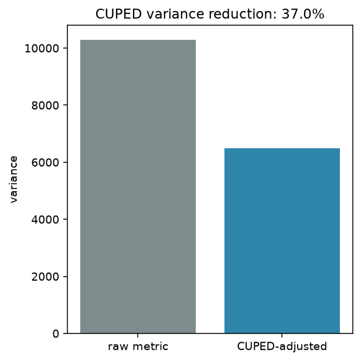
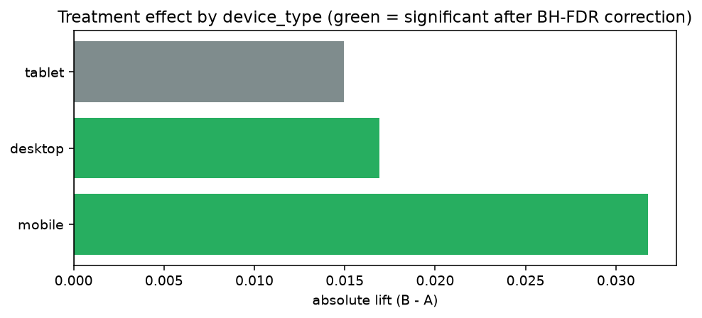

# OptiFlow — A/B Testing & Experimentation Platform

A synthetic-but-realistic **end-to-end experimentation system**: data generation, experiment
design, statistical analysis, and a decision framework for a checkout-flow A/B test — built
to mirror how mature product analytics teams (Microsoft's Experimentation Platform / ExP
being the reference point) actually run and read out experiments, not just how to run a
`scipy.stats.ttest_ind`.

**[Read the full walkthrough notebook →](notebooks/01_end_to_end_experiment_readout.ipynb)**



## Why this exists

Most A/B testing portfolio projects stop at "here's a t-test on some fake data." This one
tries to answer the questions a product data scientist actually gets asked:

- Is this result even trustworthy, or did randomization break? (**SRM / Twyman's Law**)
- Can we tighten the estimate using data we already have, instead of running longer?
  (**CUPED**)
- Would we have been fooled by checking results every day? (**sequential testing**)
- Does "the average user" hide a more interesting story? (**heterogeneous treatment effects**)
- The headline metric moved — should we actually ship? (**guardrails & decision framework**)

## What's implemented

| Area | Module | What it does |
|---|---|---|
| Data generation | [`src/simulation/generate.py`](src/simulation/generate.py) | Synthetic checkout-flow experiment with a pre-period covariate, novelty decay, device heterogeneity, a guardrail regression, and an optional injected SRM bug |
| Power analysis | [`src/stats/power.py`](src/stats/power.py) | Sample-size / MDE calculator; SRM & covariate-balance checks |
| Frequentist testing | [`src/analysis/frequentist.py`](src/analysis/frequentist.py) | Two-proportion z-test, Welch's t-test, non-parametric bootstrap CI |
| **CUPED** | [`src/analysis/cuped.py`](src/analysis/cuped.py) | Variance reduction using a pre-experiment covariate (Deng, Xu, Kohavi & Walker, WSDM 2013 — built at Microsoft's ExP) |
| Sequential testing | [`src/analysis/sequential.py`](src/analysis/sequential.py) | O'Brien-Fleming boundary monitoring + a Monte Carlo quantifying how much naive daily peeking inflates false positives |
| Bayesian testing | [`src/analysis/bayesian.py`](src/analysis/bayesian.py) | Beta-Binomial A/B test with expected loss; Bayesian bootstrap for continuous metrics |
| Heterogeneous effects | [`src/analysis/segmentation.py`](src/analysis/segmentation.py) | Per-subgroup lift with BH-FDR correction, plus a treatment×subgroup interaction regression |
| Decision framework | [`src/analysis/decision.py`](src/analysis/decision.py) | Ship / hold / don't-ship logic: trust checks first, then OEC vs. guardrails |
| Reporting | [`src/reporting/plots.py`](src/reporting/plots.py) | All charts used in the notebook and dashboard |
| Dashboard | [`src/app/main.py`](src/app/main.py) | Interactive Streamlit readout: trust checks → OEC → guardrails → sequential risk → segments → decision |

32 unit tests cover the generator's causal structure (novelty decay, device heterogeneity,
covariate balance, SRM injection) and every analysis module, using known-answer synthetic
cases (e.g. "CUPED must reduce variance when the covariate is predictive, and must *not* when
it isn't").

## The experiment, in one picture

O'Brien-Fleming sequential monitoring catches what a naive "check daily, stop at p<0.05" rule
would miss — the boundary starts wide (hard to falsely cross early) and narrows toward the
nominal α as the experiment accumulates information:



CUPED cuts the variance of a well-chosen metric substantially by regressing out a
pre-experiment covariate — here, 37% variance reduction on session duration, which is
roughly equivalent to running the same experiment with 37% fewer users:



And the average effect hides a real story — this redesign is a mobile win, not a universal one:



## Quickstart

```bash
python -m venv .venv
.venv\Scripts\activate          # macOS/Linux: source .venv/bin/activate
pip install -r requirements.txt
```

**1. Generate synthetic experiment data:**

```bash
python -m src.simulation.generate --n 60000 --baseline 0.10 --lift 0.02 --days 14 \
  --db sqlite:///data/optiflow.db --if-exists replace
```

Key flags:
- `--novelty-decay`, `--novelty-boost`, `--novelty-asymptote` — control how fast the initial
  novelty effect decays to the steady-state lift
- `--guardrail-ms` — how much the treatment regresses page-load time
- `--srm-bug` — inject a broken-randomization bug (drops 25% of mobile/B exposure events) to
  see the trust checks correctly refuse to certify the experiment

**2. Run the notebook** (`notebooks/01_end_to_end_experiment_readout.ipynb`) for the full
narrated walkthrough, or **3. launch the dashboard:**

```bash
streamlit run src/app/main.py
```

**4. Run the tests:**

```bash
pytest tests/ -v
```

## Methodology notes

- **CUPED** requires the covariate to be measured *before* assignment and `theta` to be
  estimated on the pooled sample — otherwise the adjustment can leak treatment information
  and bias the result. Both are enforced here; see [`cuped.py`](src/analysis/cuped.py)'s
  docstrings and `test_cuped.py`.
- **The O'Brien-Fleming boundary** used here (`z_(α/2) / √information_fraction`) is the
  classic Brownian-motion approximation (Jennison & Turnbull), not the exact Lan-DeMets
  alpha-spending recursion production systems typically use. It's directionally identical
  (conservative early, relaxing to α at the final look) and is enough to demonstrate *why*
  sequential correction matters — see `simulate_peeking_inflation()` for an empirical Monte
  Carlo backing that up.
- **Subgroup significance** is corrected with Benjamini-Hochberg FDR control, since testing
  many device/segment slices independently inflates the false-positive rate.
- **The decision framework** checks trust (SRM/randomization) before it will look at the OEC
  at all, and treats a guardrail regression as requiring an explicit trade-off call (`HOLD`)
  rather than silently overriding a positive OEC.

## Project structure

```
OptiFlow-AB-Analysis-System/
├── src/
│   ├── simulation/generate.py   # synthetic data generator
│   ├── stats/power.py           # sample sizing, SRM/covariate balance checks
│   ├── analysis/                # frequentist, cuped, sequential, bayesian, segmentation, decision
│   ├── reporting/plots.py       # all charts
│   ├── app/main.py              # Streamlit dashboard
│   └── config/settings.py
├── notebooks/01_end_to_end_experiment_readout.ipynb
├── tests/                       # 32 tests across generator + every analysis module
└── docs/images/                 # charts embedded in this README
```
